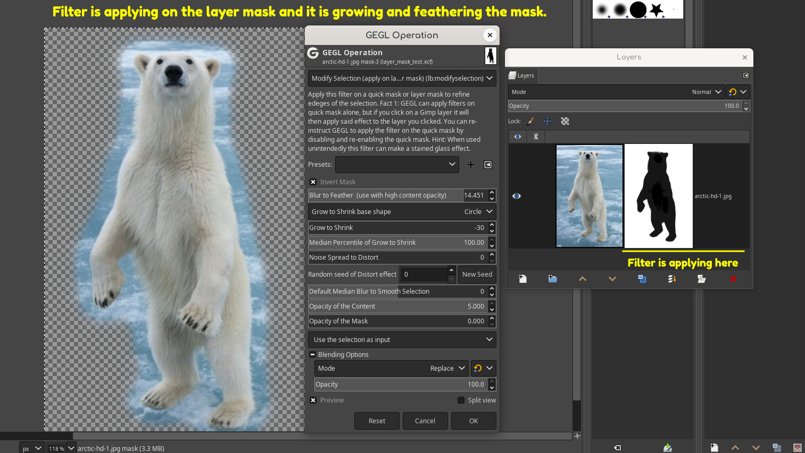

## Modify Selection - a GEGL Gimp Plugin to apply on Layer Mask or Quick Mask
Modify selections similar to Adobe Photoshop's "Refine Edges" using this Gimp GEGL plugin.

PLEASE REMEMBER! Apply this filter to Layer Mask or Quick Mask or it will NOT work correctly.

Preview of filter using its grow selection and feather option on a layer mask of a polar bear.



## Location to put binaries (they don't go in the normal plugins folder)

### Windows

 C:\Users\(USERNAME)\AppData\Local\gegl-0.4\plug-ins
 
### Linux 

 /home/(USERNAME)/.local/share/gegl-0.4/plug-ins
 
### Linux (Flatpak includes Chromebook)

 /home/(USERNAME)/.var/app/org.gimp.GIMP/data/gegl-0.4/plug-ins


Then restart Gimp and go to GEGL operation and look for "Modify Selection"

In Gimp 2.99.16+ it will be in the main menu under Selection.

## Compiling and Installing

### Linux

To compile and install you will need the GEGL header files (`libgegl-dev` on
Debian based distributions or `gegl` on Arch Linux) and meson (`meson` on
most distributions).

```bash
meson setup --buildtype=release build
ninja -C build

```
### Windows

The easiest way to compile this project on Windows is by using msys2.  Download
and install it from here: https://www.msys2.org/

Open a msys2 terminal with `C:\msys64\mingw64.exe`.  Run the following to
install required build dependencies:

```bash
pacman --noconfirm -S base-devel mingw-w64-x86_64-toolchain mingw-w64-x86_64-meson mingw-w64-x86_64-gegl
```

Then build the same way you would on Linux:

```bash
meson setup --buildtype=release build
ninja -C build
```

then put the .so or .dll binary file in the correct location listed above in "#location to put binaries"

